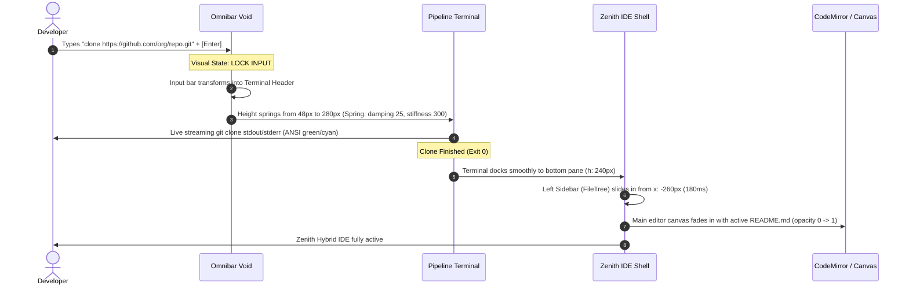

# CRUX Zero State Design Specification: The "Omnibar" Void

**Document Version:** 1.0.0-PROD  
**Status:** Approved Architecture Contract  
**Design Paradigm:** Brutalist Agentic Void / Zero-Click Launcher  
**Target:** CRUX Collaborative Execution Environment  

---

## 1. Executive Summary & Anti-Pattern Rejection

Standard IDE welcome screens (VS Code, Cursor, IntelliJ, Eclipse) suffer from a 15-year-old legacy template:
- A centered logo with marketing slogans.
- A prominent primary button ("Open Folder" / "Clone Repo") that forces mouse interaction.
- A static, vertical list of stale recent paths.
- Unnecessary cognitive load that treats experienced developers like first-time novices.

**The CRUX Imperative:**
CRUX is not a passive text editor—it is a **military-grade, agentic, multiplayer execution environment**. The launch experience must establish immediate dominance:
1. **Pure Void Canvas:** `#000000` pitch black, no chrome, no menus, zero buttons.
2. **The Central Omnibar:** A single 1px hairline command interface with an active blinking block cursor (`▋`).
3. **Zero-Click Dispatch:** The keyboard is the only required input device. Typing initiates instant context resolution (Git clone, local project load, peer drop-in, or `@CruxAI` autonomous scaffolding).
4. **Shatter-to-IDE Transition:** When a command executes, the Omnibar does not disappear; it mechanically transforms into the active IDE layout or streaming pipeline terminal.

---

## 2. Design Tokens & Visual Architecture

### 2.1 Color Matrix (Pure Brutalism)
```yaml
canvas:
  background: "#000000"          # Deepest void
  dot-grid: "#111111"            # Ultra-subtle canvas coordinate dots (12px pitch)
  crosshair: "#1F1F1F"           # 1px hairline alignment reticles

borders & hairlines:
  hairline-default: "#222222"     # 1px solid border
  hairline-hover: "#333333"       # Active hover / focus ring border
  hairline-accent: "#FFFFFF"      # High-contrast selection indicator

ink & typography:
  signal-primary: "#FFFFFF"       # Main input text and primary headers
  signal-secondary: "#A0A0A0"     # Descriptions, active hints
  signal-muted: "#555555"         # Inactive shortcuts, placeholders, metadata
  signal-code: "#D4D4D4"          # Command syntax tokens

accents:
  crux-blue: "#007AFF"           # Peer 1 cursor / Git action accent
  crux-crimson: "#FF453A"        # CruxAI agent tag
  crux-emerald: "#00FF66"        # Active mesh daemon / success status
  crux-amber: "#FF9F0A"          # Local branch warning / unsaved buffer
```

### 2.2 Typography Scale
- **Omnibar Input:** Monospace (`Geist Mono`, `JetBrains Mono`, `SF Mono`), `16px` (`text-base`), font weight `500`, tracking `-0.02em`.
- **Command Tags / Badges:** Monospace, `10px` (`text-[10px]`), font weight `700`, uppercase, tracking `+0.08em`.
- **Suggestion Titles:** Sans-serif (`Inter`, `SF Pro Display`), `13px` (`text-[13px]`), font weight `500`.
- **HUD Telemetry:** Monospace, `11px` (`text-[11px]`), font weight `400`, color `#555555`.

---

## 3. UI Anatomy & Layout Grid

```
+-----------------------------------------------------------------------------+
| [⌖ CRUX DAEMON: 0.04ms]                           [MESH: 3 PEERS LIVE ●]    |
|                                                                             |
|                                                                             |
|                                                                             |
|                                                                             |
|                        +---------------------------+                        |
|                        |   [+] CRUX HYBRID CORE    |                        |
|                        +---------------------------+                        |
|                        | > clone https://github...▋|                        |
|                        +---------------------------+                        |
|                        | [AI]   @CruxAI scaffold.. |                        |
|                        | [DIR]  startup-api        |                        |
|                        | [LIVE] Sarah L. (db.ts)   |                        |
|                        | [NEX]  Infinite Canvas    |                        |
|                        +---------------------------+                        |
|                                                                             |
|                                                                             |
|                                                                             |
|                                                                             |
|                 [Tab] Auto  [↑/↓] Select  [Enter] Execute  [Esc] Clear      |
+-----------------------------------------------------------------------------+
```

### 3.1 Component Hierarchy
1. **Background Canvas (`CruxVoidCanvas`):**
   - Full viewport `100vw` x `100vh`, background `#000000`.
   - Subtle center reticle (hairline crosshairs at center quadrants, length 12px, stroke 1px, `#222222`).
2. **Top Telemetry Bar (`VoidHUD`):**
   - Left: Daemon status (`CRUX DAEMON // LOCAL MESH: 0.08ms | MEM: 42MB`).
   - Right: Live peer radar indicator (`3 PEERS ACTIVE ●`).
3. **The Core Omnibar (`VoidOmnibar`):**
   - Centered vertically and horizontally (`top: 42%` optical center).
   - Width: `640px` (responsive: `max-w-[90vw]`).
   - Border: `1px solid #222222`, background `#050505`.
   - Header badge: 1px crosshair logo + `CRUX // HYBRID EXECUTION MATRIX`.
   - Input line: Prefix prompt `❯ ` in `#FFFFFF` or `#00FF66`, followed by unstyled text input with a custom CSS blinking block caret.
4. **Command & Suggestion Surface (`VoidDropMatrix`):**
   - Integrated directly beneath the input (flush border, no gaps, single unified container).
   - Max height `320px`, scrollable with 2px hairline scrollbar.
   - Categorized dynamic results:
     - **Quick Actions:** Clone repo, New file, Open canvas.
     - **Agent Triggers:** `@CruxAI <query>`.
     - **Recent Local Projects:** Fuzzy-matched workspaces.
     - **Live Multiplayer Radar:** Active teammate workspaces.
5. **Bottom Keystroke Bar (`VoidKeymapBar`):**
   - Pinned at `bottom: 24px`.
   - Monospace subdued key indicators: `[Tab] Complete`, `[↑/↓] Select`, `[↵] Execute`, `[Esc] Reset`, `[⌘K] Commands`.

---

## 4. Keystroke & Interaction State Machine

### 4.1 Input Parsers & Command Heuristics

The Omnibar instantly parses raw strings on every keystroke (`onChange`) with zero debounce latency:

| Input Pattern | Detected Type | Action on `[Enter]` |
| :--- | :--- | :--- |
| `http://...` or `https://...` or `git@...` | **Git Clone** | Clones repo directly into workspace & mounts file tree |
| `@CruxAI ...` or `ai: ...` | **Autonomous Agent Scaffold** | Generates full multi-file project live on terminal pipeline |
| Existing workspace / folder name (e.g. `collab-editor`) | **Recent Workspace** | Instantly opens folder into Zenith editor |
| Peer username (e.g. `sarah`, `alex`) | **Live Peer Spectate** | Drops directly into peer's active file & shared cursor session |
| `canvas` or `nexus` or `spatial` | **Nexus Mode** | Transitions directly into the Infinite 2D Spatial Canvas |
| `new <filename>` (e.g. `new main.rs`) | **Scratchpad Buffer** | Creates file immediately and opens in Zenith CodeMirror |
| General text query (e.g. `react dashboard`) | **Fuzzy Command Search** | Filters indexed commands, files, and recent branches |

### 4.2 Keyboard Navigation Contracts
- **`[Any alphanumeric character]`**: Automatically focuses input from anywhere on the screen (no need to click into the bar).
- **`[Arrow Down / Arrow Up]`**: Cycles through suggestion rows with wrapping. Highlighted item gains `bg-[#111111]`, left border `2px solid #FFFFFF`.
- **`[Tab]`**: Autocompletes selected row into the input buffer.
- **`[Enter]`**: Executes selected row or the active typed command.
- **`[Escape]`**: Clears input; if already empty, resets suggestion list to default radar view.
- **`[Cmd / Ctrl + K]`**: Toggles standard full command palette modal if developer prefers classic search.

---

## 5. Shatter-to-IDE Transition (Motion & Choreography)

Rather than an abrupt page reload or standard opacity fade, CRUX employs a **Shatter-to-Dock** layout transition:



### Transition Timing Matrix
- **Expansion (Input to Terminal):** `200ms`, `cubic-bezier(0.16, 1, 0.3, 1)`.
- **Docking (Center to Bottom):** `240ms`, `cubic-bezier(0.2, 0, 0, 1)`.
- **Sidebar & Header Slide-In:** `180ms`, staggered by `40ms`.
- **Zero Layout Glitch Guarantee:** All dimensions calculated with fixed flex units (`min-h-0`, `shrink-0`) to prevent scroll jumps.

---

## 6. Implementation Architecture

### 6.1 Component Tree
```
components/crux/void/
├── CruxOmnibarVoid.tsx        # Top-level Zero State Controller
├── VoidCanvas.tsx             # 1px reticle canvas background & subtle dot grid
├── VoidHUD.tsx                # Daemon latency counter & multiplayer radar badge
├── VoidOmnibarInput.tsx       # 1px border input with blinking block caret
├── VoidSuggestionMatrix.tsx   # Dynamic suggestion rows (Clone, AI, Recent, Peers)
├── VoidTerminalStage.tsx      # In-place terminal container during clone/scaffold
└── VoidKeymapBar.tsx          # Monospace keyboard shortcut telemetry
```

### 6.2 Workspace Store Integration
Add zero-state orchestration flags in `lib/store.ts`:
```typescript
interface WorkspaceState {
  // Zero State Controller
  isZeroStateOpen: boolean;
  setZeroStateOpen: (open: boolean) => void;
  launchSequenceState: "idle" | "parsing" | "executing" | "shattering" | "mounted";
  setLaunchSequenceState: (state: LaunchSequenceState) => void;
  
  // Execution Handlers
  executeLaunchCommand: (command: string) => Promise<void>;
}
```

---

## 7. Accessibility & Graceful Fallbacks

1. **Screen Readers (`ARIA`):**
   - The Omnibar uses `role="combobox"` with `aria-expanded`, `aria-autocomplete="list"`, and `aria-controls="void-suggestions"`.
   - Each suggestion row has `role="option"` with `aria-selected` tracking current keyboard index.
2. **Offline Mode:**
   - If mesh connection or git network is unreachable, daemon status displays `OFFLINE (LOCAL CACHE ONLY)` with zero UI stalls.
3. **Touch / Mobile Compatibility:**
   - On mobile/tablet viewports, suggestions render touch targets (`h: 40px`), and a software keyboard trigger button is rendered cleanly.

---

## 8. Verification & Acceptance Criteria

- [ ] **Instant Boot:** Canvas renders in `< 25ms` without layout shift or white flash.
- [ ] **No Mouse Required:** All workflows (clone, open, scaffold, drop-in) navigable solely via keyboard.
- [ ] **Real Git Clone Execution:** Entering a valid GitHub URL invokes `/api/terminal/stream` or `/api/git` and streams live logs.
- [ ] **Seamless Morph:** Screen cleanly expands into the Zenith IDE layout with active terminal buffer preserved.
- [ ] **Brutalist Compliance:** Zero rounded-xl pills, zero glossy gradients; strict adherence to 1px `#222222` hairlines and `#000000` void.
